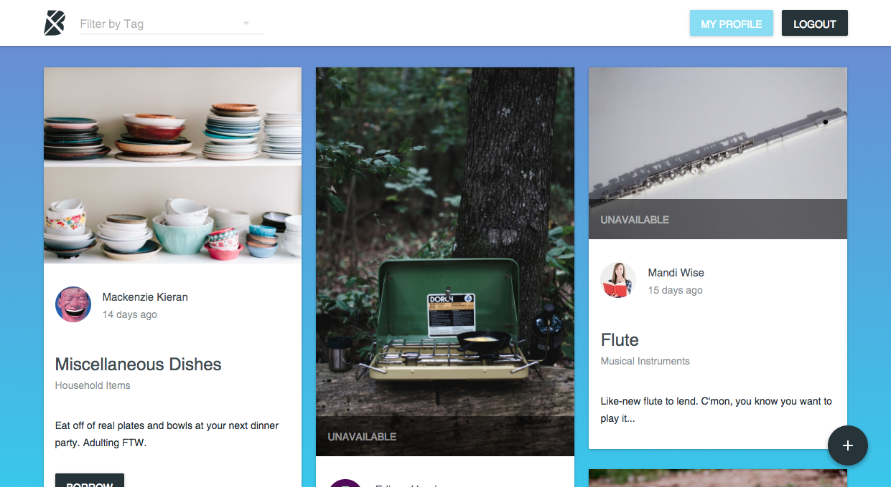

# Boomtown 

Boomtown is a web-based application to support a local sharing economy, allows users to browse all items and user profiles. 
It uses local mock data, React and the Material UI library to build out the application's UI, Redux and react-redux to manage application state, and React Router for routing.

## Technologies used
- React
- Material UI
- Redux
- React Redux
- Redux Thunk
- JSX
- ES 2016
- Webpack
- CSS3
- GraphQL
- Express
- PostgreSQL
- Firebase


## Installation

Download the repo, then run:

```bash
cd client && npm install
```

## Start-up

From inside the `client` directory, run:

```bash
npm run dev
```

From inside the `server` directory, run:

```bash
npm start
```

## Screenshots
